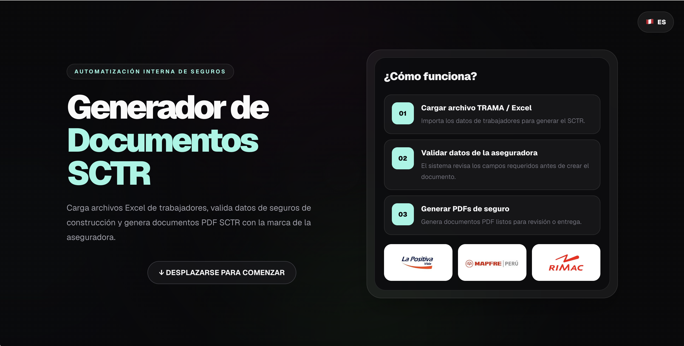
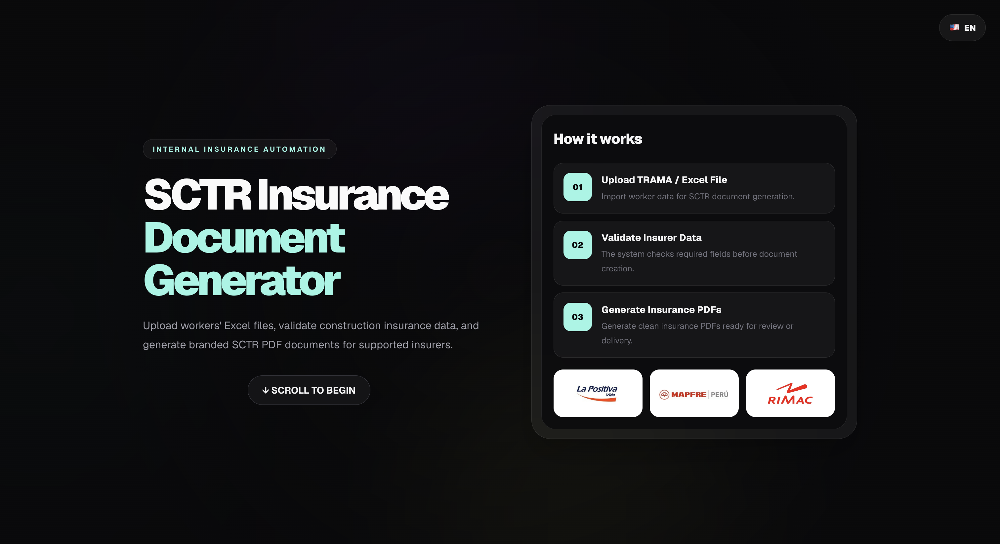
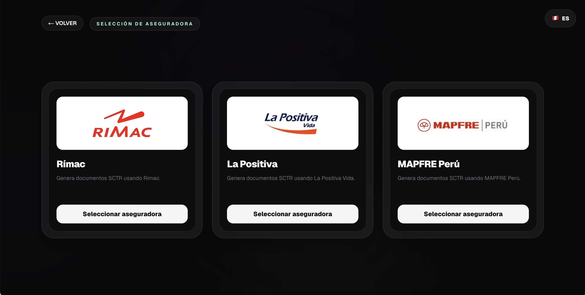
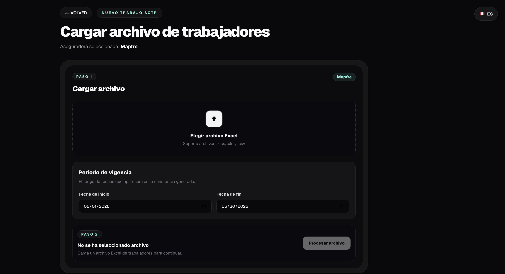

# SCTR Insurance Document Generator

A full-stack internal web application for generating branded SCTR insurance documents from worker Excel files.

The app allows users to select an insurer, upload a worker/TRAMA spreadsheet, validate the data, preview parsed rows, and generate insurer-branded PDF documents.

## Live Demo

Demo: `https://sctr-insurance-document-generator.vercel.app/`

For testing Stripe checkout, use Stripe test mode only:

* Card: `4242 4242 4242 4242`
* Expiration: any future date
* CVC: any 3 digits

## Screenshots

### Landing Page — Spanish



### Landing Page — English



### Insurer Selection



### Upload Workflow



## Features

* Insurer selection workflow for Rímac, La Positiva, and MAPFRE Perú
* Excel/TRAMA file upload and parsing
* Insurer-specific data validation
* PDF validity date selection
* Parsed worker data preview
* Branded SCTR PDF generation
* Stripe checkout integration
* Spanish / English language toggle
* Responsive dark UI built with Tailwind CSS
* Backend insurer email delivery: automatically forwards the uploaded Excel/TRAMA file to the correct insurer inbox after successful payment and PDF generation

## Tech Stack

* Next.js
* React
* TypeScript
* Node.js
* Tailwind CSS
* XLSX
* Zod
* Playwright
* Stripe API
* QRCode
* HTML/CSS

## Why I Built This

This project was built to automate a manual insurance document workflow. Instead of repeatedly formatting SCTR insurance documents by hand, the app parses structured worker files, validates required fields, and generates branded PDF documents for supported insurers.

The goal was to reduce repetitive administrative work, improve data validation, and create a cleaner internal workflow for document generation.

## Core Workflow

1. Select an insurer
2. Upload a worker Excel/TRAMA file
3. Confirm PDF validity dates
4. Parse and validate the file
5. Review parsed worker rows
6. Generate the final branded SCTR PDF

## Local Development

Clone the repository:

```bash
git clone https://github.com/CoryOr/sctr-insurance-document-generator.git
cd sctr-insurance-document-generator
```

Install dependencies:

```bash
npm install
```

Create a local environment file:

```bash
cp .env.example .env.local
```

Run the development server:

```bash
npm run dev
```

Open:

```txt
http://localhost:3000
```

## Environment Variables

Create a `.env.local` file with the required values.

```env
STRIPE_SECRET_KEY=
NEXT_PUBLIC_STRIPE_PUBLISHABLE_KEY=
NEXT_PUBLIC_ALLOW_PDF_PREVIEW=
```

Do not commit `.env.local`.

## Project Structure

```txt
app/
  page.tsx
  insurers/
    page.tsx
  jobs/
    new/
      page.tsx
      UploadTrama.tsx
      PayAndGenerateButton.tsx
  api/
    parse-trama/
    generate-pdf/

components/
  LanguageToggle.tsx

lib/
  i18n.ts

public/
  pdf-assets/
```

## What I Learned

* Building full-stack workflows with the Next.js App Router
* Handling file uploads and spreadsheet parsing
* Creating validation flows for insurer-specific templates
* Managing server-side PDF generation
* Integrating Stripe checkout with protected document generation
* Designing a bilingual UI with reusable translation data
* Improving UX for internal tools and form-heavy workflows
* Automated a full backend workflow connecting PDF generation, payment verification, and insurer email delivery.

## Future Improvements

* Add authenticated admin users
* Store generation history
* Add more insurer templates
* Improve automated testing coverage
* Add audit logs for generated documents
